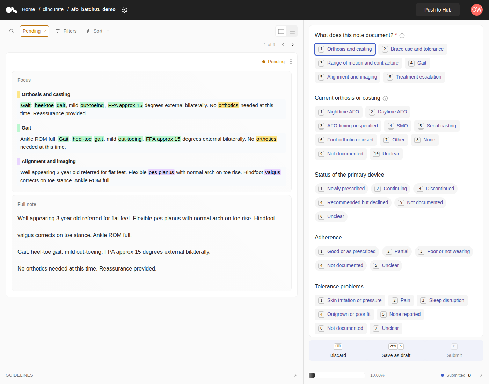

# ClinCurate

Schema-driven clinical abstraction and sequential validation, built on [Argilla](https://github.com/argilla-io/argilla) (Apache 2.0).

A YAML schema defines the variables, allowed answers, cue terms and regex patterns. ClinCurate turns it into an Argilla annotation project with highlighted Focus Mode snippets, a structured form, evidence capture, and exports with per-field provenance. Agreement statistics use patient-clustered bootstrap intervals for precision-based stopping.

First use case: pediatric foot and ankle phenotypes (orthoses, dorsiflexion, gait, escalation) at UCSF.



## Status

Stage 0 prototype. See `docs/mvp-spec.md` for the design, verified constraints, and staged plan.

## Quick start

```
pip install -e ".[dev,argilla]"
clincurate validate templates/pediatric_foot_ankle.yaml
clincurate preview templates/pediatric_foot_ankle.yaml examples/synthetic_notes/notes.csv --out preview.html
clincurate guide templates/pediatric_foot_ankle.yaml --out guide.md
pytest
```

Local Argilla for development (synthetic data only):

```
docker run -d -p 6900:6900 -e USERNAME=owner -e PASSWORD=12345678 -e API_KEY=dev.apikey argilla/argilla-hf-spaces:v2.8.0
```

```python
import argilla as rg
from clincurate import load_schema
from clincurate.argilla_backend import push_dataset
from clincurate.cli import read_notes

client = rg.Argilla(api_url="http://localhost:6900", api_key="dev.apikey")
project = load_schema("templates/pediatric_foot_ankle.yaml")
push_dataset(client, project, read_notes("examples/synthetic_notes/notes.csv"), "afo_batch01_demo", "clincurate")
```

## Layout

- `clincurate/schema.py`: schema loading and validation
- `clincurate/highlight.py`: neutral cue and regex highlighting
- `clincurate/focus.py`: Focus Mode snippets
- `clincurate/export.py`: response resolution, provenance, wide and long exports, disagreements
- `clincurate/stats.py`: kappa, clustered bootstrap, stopping check
- `clincurate/argilla_backend.py`: the only Argilla-dependent module
- `templates/`: project schemas
- `examples/synthetic_notes/`: fabricated notes for tests and demos

## PHI

Never commit real clinical text. Deploy only inside an approved institutional environment. Gold standard mode never shows model output to annotators.
