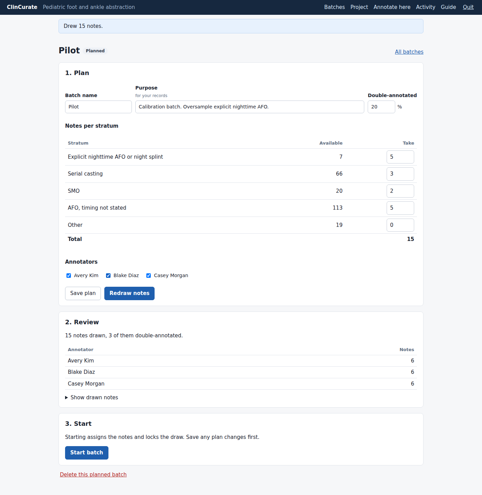
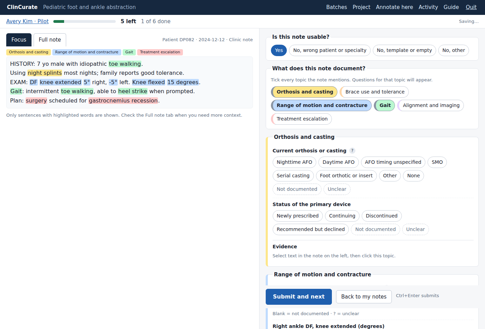

# ClinCurate

ClinCurate is a local, offline chart abstraction app for clinical notes. It runs entirely on one laptop, opens in the browser, and never sends data over the network. Nobody needs a command line.

- **Coordinators** import notes, add annotators, plan batches by sampling stratum with a double-annotated share, send out batches, collect results, and check agreement and exports.
- **Annotators** work through their notes with highlighted evidence sentences (Focus), save evidence by selecting text, answer a form that shows only the relevant questions, and always see how many notes are left. Work autosaves.

The first use case is pediatric foot and ankle phenotypes at UCSF (orthoses, dorsiflexion, gait, escalation).




## Running it

Coordinators and annotators: open `ClinCurate.exe` (Windows) or `ClinCurate.app` (macOS). The app opens a browser tab. Use **Quit** in the top bar to close it. Data stays in a `ClinCurate` folder in your home directory.

Download from the repository's **Releases** page, release "ClinCurate (latest build)":

- Mac: `ClinCurate.dmg`. Open it and drag ClinCurate into Applications. Built for Apple Silicon (M1 and later).
- Windows: `ClinCurate.exe`. Save it anywhere and double-click it.

First launch: the app is not code-signed, so the operating system asks once.

- Windows: on "Windows protected your PC", click **More info**, then **Run anyway**.
- macOS: right-click **ClinCurate** in Applications, choose **Open**, then **Open** again. If macOS still refuses, open System Settings, Privacy & Security, and click **Open Anyway**.

## Where the data lives

The coordinator's laptop holds the permanent record: all notes, every batch, and every submitted answer. Student laptops hold a working copy of their own batch only.

1. The coordinator starts a batch and downloads one batch file (`.ccpkg`) per student.
2. The student opens it in ClinCurate, annotates, and clicks **Save results file for coordinator** (`.ccres`: answers only, no note text). The app warns whenever there are answers not yet sent.
3. The coordinator imports the results file. The batch page shows when each student's latest file arrived.
4. The coordinator tells the student it arrived. The student clicks **Remove from this laptop**, which deletes the notes and answers from their machine.
5. The coordinator downloads an encrypted backup (`.ccbak`) after importing results and keeps it in PHI-approved storage. A backup restores onto a new laptop from the welcome screen.

All three file types are encrypted with the project passphrase. Share the passphrase separately from the files.

## Development

```
pip install -e ".[dev]"
python -m clincurate          # starts the app and opens a browser
pytest
pyinstaller packaging/clincurate.spec
```

Demo data: `examples/synthetic_notes/demo_notes.csv` (240 fabricated notes). Never commit real clinical text.

## Documents

- `docs/mvp-spec.md`: design, workflows, security model, next steps
- `docs/annotation-guide.md`: annotator guide generated from the schema
- `clincurate/schemas/pediatric_foot_ankle.yaml`: questions, highlight cues, sampling strata

## Layout

- `clincurate/schema.py`: project schema
- `clincurate/highlight.py`, `focus.py`: highlighting and Focus snippets
- `clincurate/store.py`: SQLite storage
- `clincurate/sampling.py`: batch draws and assignment
- `clincurate/packages.py`: encrypted batch and results files
- `clincurate/export.py`, `reports.py`, `stats.py`: exports and agreement
- `clincurate/app.py`, `clincurate/web/`: the interface
- `clincurate/launcher.py`, `packaging/`: double-click app
